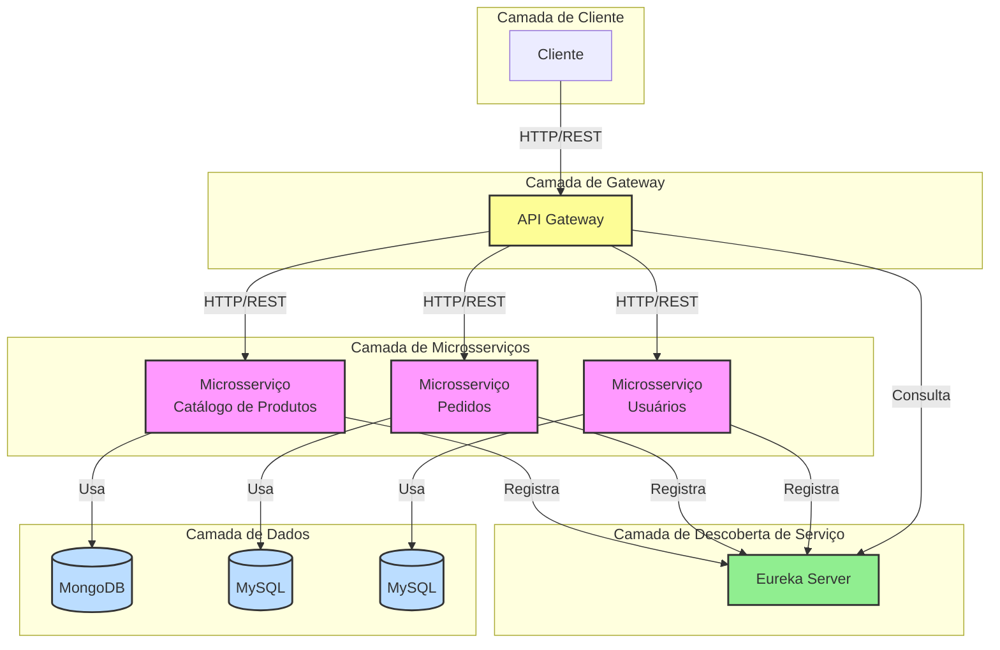

## Desenho da Arquitetura


## Executar
1. ./build-image.sh
2. docker compose up

## Exemplos de Chamadas para os Endpoints

Aqui estão exemplos de como chamar os endpoints dos serviços que implementamos, organizados na ordem Cliente, Catalogo de Produto e Pedido. Certifique-se de que os serviços estejam em execução antes de testar estas chamadas.

### Serviço de Clientes

1. Criar um novo cliente:
   ```bash
   curl -X POST http://localhost:8080/api/customers \
   -H "Content-Type: application/json" \
   -d '{
     "name": "João Silva",
     "email": "joao.silva@email.com",
     "password": "senha123"
   }'
   ```

2. Obter todos os clientes:
   ```bash
   curl http://localhost:8080/api/customers
   ```

3. Obter um cliente específico (substitua {id} pelo ID real do cliente):
   ```bash
   curl http://localhost:8080/api/customers/{id}
   ```

4. Atualizar um cliente (substitua {id} pelo ID real do cliente):
   ```bash
   curl -X PUT http://localhost:8080/api/customers/{id} \
   -H "Content-Type: application/json" \
   -d '{
     "name": "João Silva Jr.",
     "email": "joao.silva.jr@email.com"
   }'
   ```

5. Deletar um cliente (substitua {id} pelo ID real do cliente):
   ```bash
   curl -X DELETE http://localhost:8080/api/customers/{id}
   ```


### Serviço de Catalogo de Produto

1. Criar um novo Produto:
```bash
curl -X POST http://localhost:8080/api/products \
     -H "Content-Type: application/json" \
     -d '{
         "name": "Smartphone XYZ",
         "description": "Modelo mais recente com recursos avançados",
         "price": 999.99,
         "categories": ["Eletrônicos", "Telefones"],
         "attributes": {
             "color": "Preto",
             "storage": "128GB"
         },
         "images": ["http://example.com/image1.jpg", "http://example.com/image2.jpg"],
         "stock": 100
     }'
```

2. Obter todos os produtos

```bash
curl http://localhost:8080/api/products
```

3. Obter um produto específico por ID

```bash
curl http://localhost:8080/api/products/{id}
```

4. Atualizar um produto

```bash
curl -X PUT http://localhost:8080/api/products/{id} \
     -H "Content-Type: application/json" \
     -d '{
         "name": "Smartphone XYZ - Atualizado",
         "description": "Modelo mais recente com recursos avançados e novas melhorias",
         "price": 899.99,
         "categories": ["Eletrônicos", "Telefones", "5G"],
         "attributes": {
             "color": "Preto",
             "storage": "256GB"
         },
         "images": ["http://example.com/image1.jpg", "http://example.com/image2.jpg", "http://example.com/image3.jpg"],
         "stock": 150
     }'
```

5. Deletar um produto

```bash
curl -X DELETE http://localhost:8080/api/products/{id}
```

Nota: Substitua `{id}` pelo ID real do produto para as operações GET, PUT e DELETE.

## Dicas Adicionais

1. Para formatar a saída JSON, você pode usar `jq`. Por exemplo:

   ```bash
   curl http://localhost:8080/api/products | jq
   ```

2. Para ver os cabeçalhos de resposta, adicione a flag `-i`:

   ```bash
   curl -i http://localhost:8080/api/products
   ```

3. Para informações mais detalhadas sobre a requisição e resposta, use a flag `-v`:

   ```bash
   curl -v http://localhost:8080/api/products
   ```

4. Se você estiver usando o Windows PowerShell, pode ser necessário escapar as aspas duplas no payload JSON. Use aspas simples para envolver todo o JSON e aspas duplas para os campos internos.


### Serviço de Pedidos

1. Criar um novo pedido:
   ```bash
   curl -X POST http://localhost:8080/api/orders \
   -H "Content-Type: application/json" \
   -d '{
     "customerId": 1,
     "items": [
       {
         "productId": 1,
         "quantity": 2,
         "price": 999.99
       }
     ],
     "totalAmount": 1999.98
   }'
   ```

2. Obter todos os pedidos:
   ```bash
   curl http://localhost:8080/api/orders
   ```

3. Obter um pedido específico (substitua {id} pelo ID real do pedido):
   ```bash
   curl http://localhost:8080/api/orders/{id}
   ```

4. Atualizar o status de um pedido (substitua {id} pelo ID real do pedido):
   ```bash
   curl -X PATCH http://localhost:8080/api/orders/{id}/status?status=CONFIRMED
   ```

Lembre-se de que essas chamadas estão sendo feitas através do API Gateway na porta 8080. O gateway redireciona as requisições para os serviços apropriados com base no path da URL.
